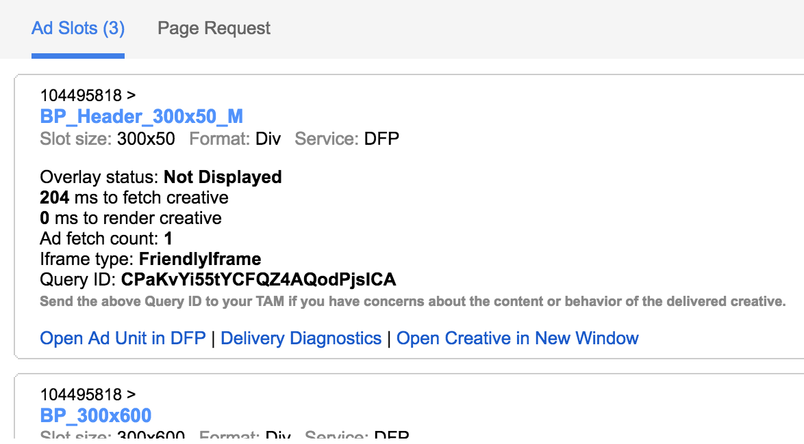
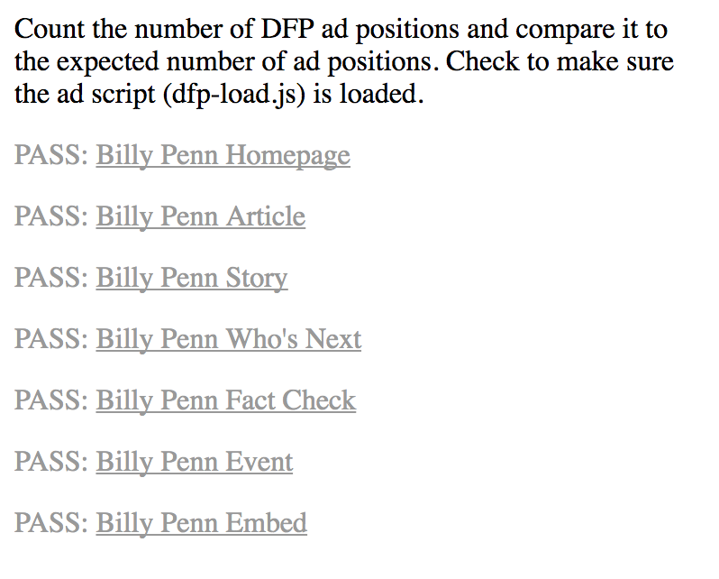
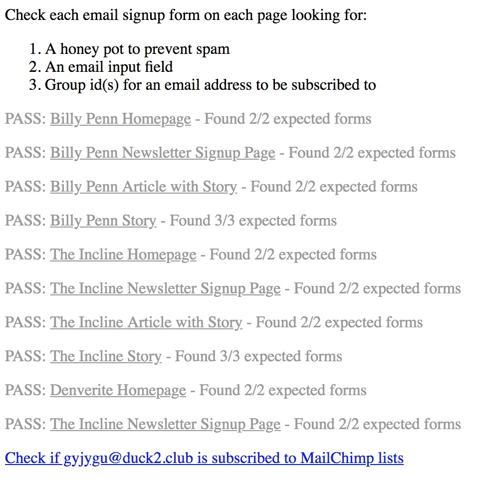

# Post-Deployment QA Checklist

After every deployment, take each of the following steps to ensure that our most critical systems are functioning as expected.

If you see anything wrong, take a screenshot and notify the product team immediately.

## Setup
Create a bookmark named "Ad debugger" and enter this as the URL:
```
javascript:googletag.openConsole()
```

## Do the ads work?
### First, a visual check.
Visit this [story about donuts](https://billypenn.com/2017/09/26/we-knew-nothing-about-donuts-and-other-stories-in-the-new-federal-donuts-book/). You may not see any ads -- that’s okay. Our ad server may not have any ads to display at this moment. Click your Ad Debugger bookmark. The console below should show four ad slots, like this:




Close the debugger console.

### Second, an automated check.
This tool will check all the ad slots on the site. Every line should reads “PASS”, like this:



  - Visit the [Billy Penn ad checker](https://billypenn.com/qa/ad-checker.php)
  - Visit the [The Incline ad checker](https://theincline.com/qa/ad-checker.php)
  - Visit the [Denverite ad checker](https://denverite.com/qa/ad-checker.php)

## Do our newsletter signups work?

 - Grab a temporary email address by visiting [Nada Mail](https://getnada.com/)
 - Visit https://billypenn.com/qa/email-signup-checker.php
 - Enter your temporary email address into the input field and click the "Test Email Signup" button
 - The automated check will count the number of signup forms found on each page and compare it with the number of expected signup forms
 - Each form will check for an input field to enter an email address, a hidden honeypot field to prevent spam, hidden group ID fields to subscribe the email address to a MailChimp group(s)
 - The script will signup the email address to each signup field
 - All checks should pass which looks like this



 - When finished, check that the email address is subscribed to different MailChimp lists
 - With a fresh email address you should see results like this


## Does our contact cookie work?

This tool checks if our contact cookie data is being set correctly. Visit each
URL and make sure the green test is shown indicating the test passed.

- Visit the [Billy Penn contact cookie checker](https://billypenn.com/qa/contact-cookie-checker.php)
- Visit the [The Incline contact cookie checker](https://theincline.com/qa/contact-cookie-checker.php)
- Visit the [Denverite contact cookie checker](https://denverite.com/qa/contact-cookie-checker.php)
