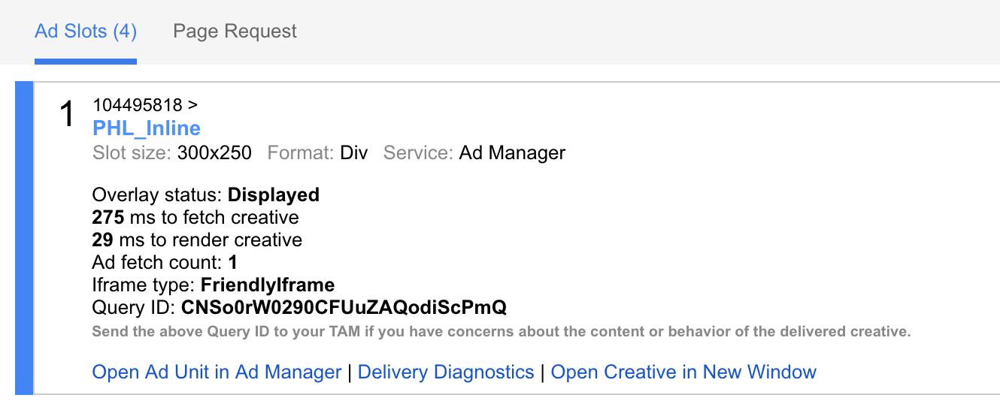

# Post-Deployment QA Checklist

After every deployment, take each of the following steps to ensure that our most critical systems are functioning as expected.

If you see anything wrong, take a screenshot and notify the product team immediately.

## Setup
Create a bookmark named "Ad debugger" and enter this as the URL:
```
javascript:googletag.openConsole()
```

## Do the ads work?
### First, a visual check.
Visit this [story about donuts](https://billypenn.com/2017/09/26/we-knew-nothing-about-donuts-and-other-stories-in-the-new-federal-donuts-book/). You may not see any ads -- that’s okay. Our ad server may not have any ads to display at this moment. Click your Ad Debugger bookmark. The console below should show three ad slots, like this:

||
|---|

Close the debugger console.

### Second, an automated check.
Visit the [ad checker](https://billypenn.com/qa/ad-checker.php).  This tool will check all the ad slots on the site. Every line should reads “PASS”, like this:

||
|---|

## Do our newsletter signups work?

**Currently these tests are broken.** You'll need to signup for the newsletter manually for now.

### Setup
Get a temporary email address by visiting [Nada Mail](https://getnada.com/). Copy the address, and keep this tab open.

### First, a visual check.
Visit this [story about weird yoga](https://theincline.com/2017/10/09/i-tried-all-of-pittsburghs-weird-yoga-classes-and-it-changed-my-life/). You should see a newsletter subscription prompt, like this:

||
|---|

Enter your temporary email address and click “Sign up”. You should see a confirmation, like this:

||
|---|

Go back to your Nada Mail tab and wait. You should see a confirmation email shortly, like this:

||
|---|

Click the email and then click the confirmation link. You should be redirected to a confirmation page that says “Yippee skippy!”, like this:

||
|---|

### Final check, and cleanup
Visit the [email signup checker](https://billypenn.com/qa/email-signup-checker.php). Enter your temporary email address and click “Test email signups”. You should see that all the checks passed, and that the emails were sent, like this:

||
|---|

Go back to your Nada Mail tab and wait a couple minutes. You should see six more subscription confirmations, like this:

||
|---|

Click one of the Billy Penn emails and then click the confirmation link. You should be redirected to a confirmation page that says “Yippee skippy!”, like the one we saw in the previous step.

Open the [contacts list in ActiveCampaign](https://spiritedmedia.activehosted.com/app/contacts). Enter your temporary email in the search box at the upper-right corner of the table.

Look at the “Lists” property in the info box. You should see a handful of mailing lists named, one for each that you tested (and one that’s labelled “All contacts”, which you can ignore), like this:

||
|---|

Finally, click the little gear icon next to the contact’s email address, click “Delete” and confirm.

||
|---|
